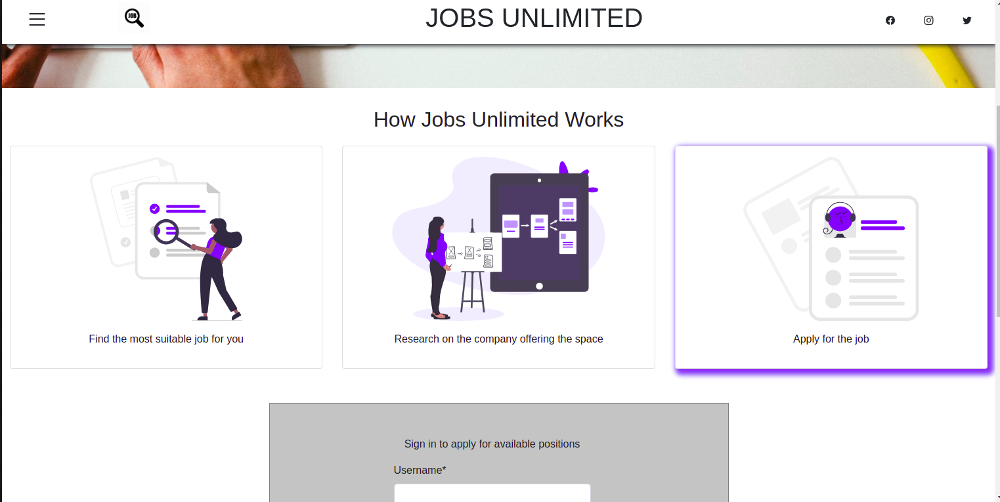
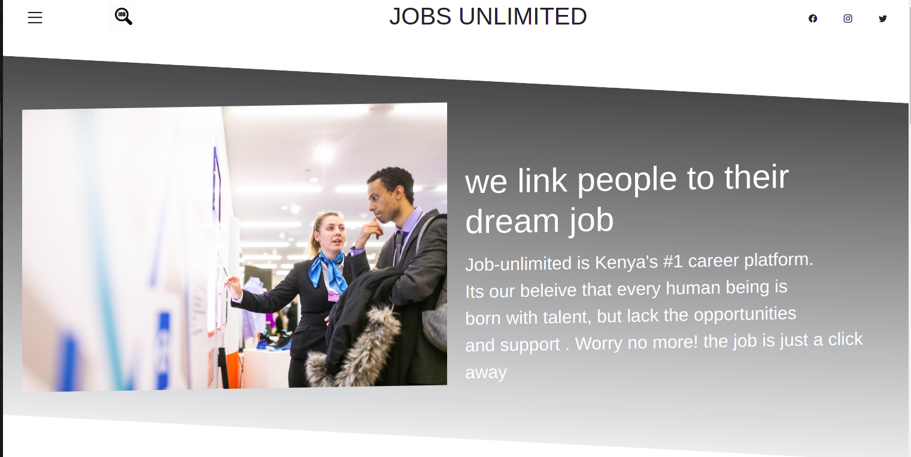
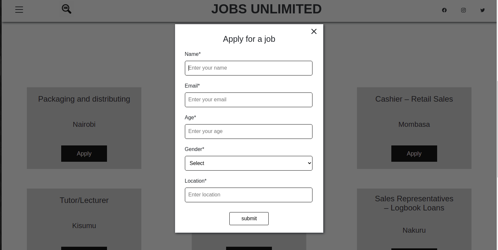
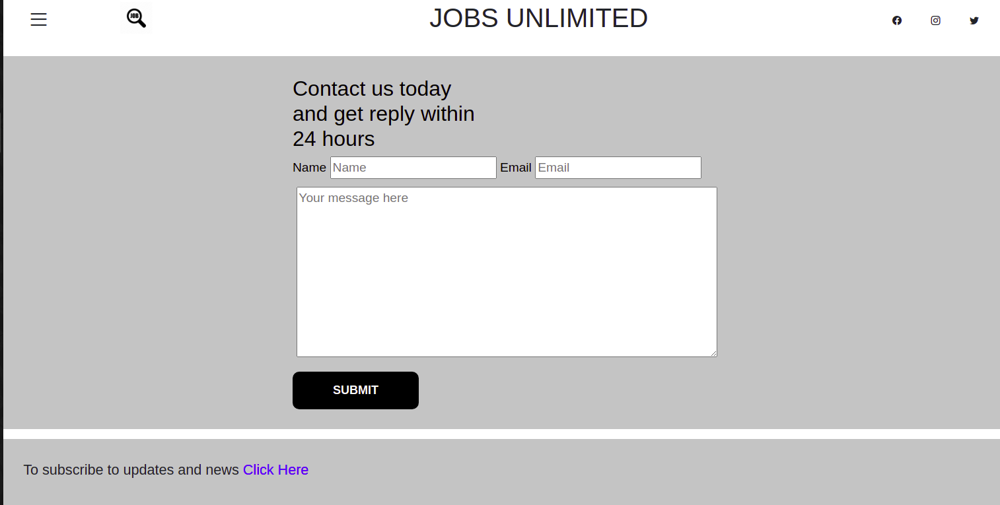

# Job-unlimited
#### Jobs-unlimited is a web app that seeks to solve the issue of unemployment by revealing present opportunities to job seekers. Job seekers create their accounts then view available positions before applying to any of their liking. One can also post gaps seeking for personnel form their companies. Click the live llink below to tour the site.}, {Created on 5th August 2021
#### By
**Aron kipkoech langat**

**Marvin Macharia**

**kyle kibet**

**Edwin Kithinji**

## Description
This a webApp that links people to the available jobs of their need in any place they prefer


<br>

<br>

<br>


## Setup/Installation Requirements
* Fork/Clone the repository
```
   $ git clone https://github.com/marvinandreassen/Jobs-Unlimited.git
```
* Open your project on your favorite editor
* Open project on Live Server
## Known Bugs
Currently there are no known bugs.If you experience any you can reach us via email: jobsavailable@gmail.com
## Technologies Used
In this project, I used the following technologies:
* HTML
* CSS
* Bootstrap
* Javascript
* Jquery
## Support and contact details
Incase of any issue and you would like to be helped to sort out, don't hessitate to contact me via:
<br>
Phone: <a>+254701020304</a>
<br>
Email: <a href="mailto:jobsavailable@gmail.com">jobsavailable@gmail.com</a>

### License
**<a href="https://github.com/marvinandreassen/Jobs-Unlimited/blob/main/LICENSE">MIT LICENSE</a>**
<br>
Copyright (c) 2021, Marvin Macharia,Aron kipkoech langat,Kyle Kibet,Edwin Kithinji. 

